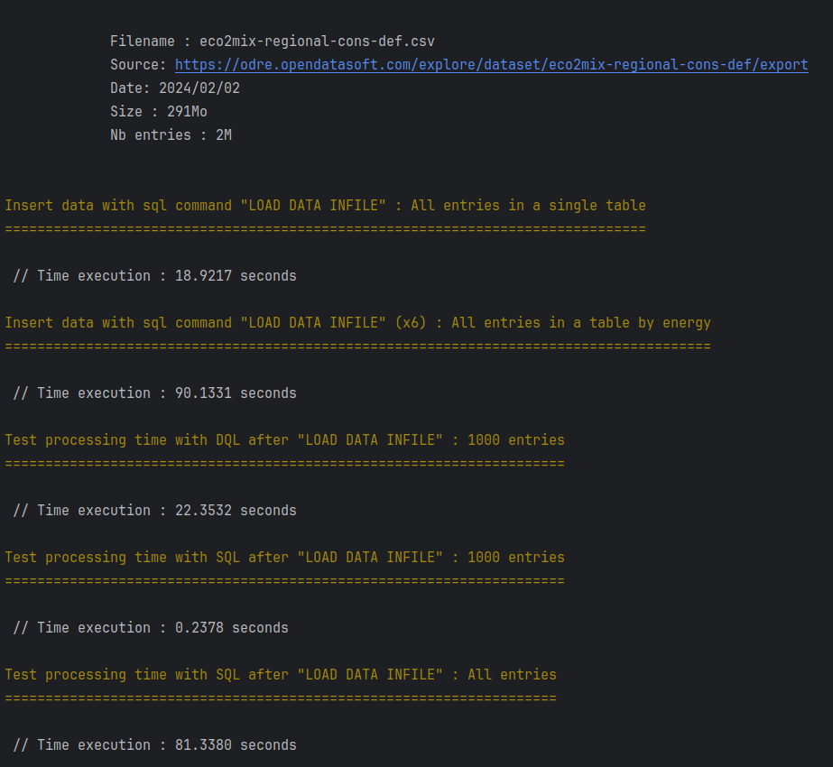

# Consomacteur


Tester l'insertion d'un fichier CSV volumineux à travers la création d'une API REST sur les données de consommation d'énergie en France et par régions.


## Fonctionnalités
- [x] Création des endpoints
- [x] Import csv volumineux avec LOAD DATA LOCAL INFILE
- [x] Import csv volumineux avec Symfony Messenger + Systemd
- [x] Authentification JWT

## Pour commencer

### Pré-requis

- PHP >= 8.2
- Composer v2
- MariaDB
- [Export csv - ODRE](https://odre.opendatasoft.com/explore/dataset/eco2mix-regional-cons-def/export/?disjunctive.libelle_region&disjunctive.nature) 

### Installation

Éxécutez les commandes ci-dessous pour utiliser le projet.

* Initialisation:
```
- make first-install
- symfony console init:datas-db
- symfony console app:create-user
```
* (option 1) Importer les données :
```
- symfony console import:open-data-csv nom_du_fichier.csv
```

* (option 2) Importer les données avec messenger :
```
- symfony console import:open-data-csv-messenger nom_du_fichier.csv
- make messenger-consume
```

* (option 2) Importer les données avec messenger + un service systemd :
```
- make systemd-create-link ## Editer le chemin
- make systemd-worker-start
- symfony console import:open-data-csv-messenger nom_du_fichier.csv
```

## Stack technique

* [Api Platform 3](https://api-platform.com/) - API-first Framework
* [Symfony 7](https://symfony.com/) - Framework PHP
* Doctrine ORM + MariaDB
* [doctrine/doctrine-fixtures-bundle](https://symfony.com/bundles/DoctrineFixturesBundle/current/index.html)

## Outils QA & Tests utilisés
* [friendsofphp/php-cs-fixer](https://github.com/PHP-CS-Fixer/PHP-CS-Fixer) - PHP Coding Standards Fixer
* [phpstan/phpstan](https://github.com/phpstan/phpstan) - PHP Static Analysis Tool
* [nunomaduro/phpinsights](https://github.com/nunomaduro/phpinsights) - Static Analysis Tool
* [phpro/grumphp](https://github.com/phpro/grumphp) - 
* [symfony/test-pack](https://symfony.com/doc/6.4/testing.html#application-tests) - PHP Unit

## Ressources externes utilisées
* **ODRE (OPENDATA RÉSEAUX-ÉNERGIES)** : https://odre.opendatasoft.com/explore/dataset/eco2mix-regional-cons-def/export/?disjunctive.libelle_region&disjunctive.nature